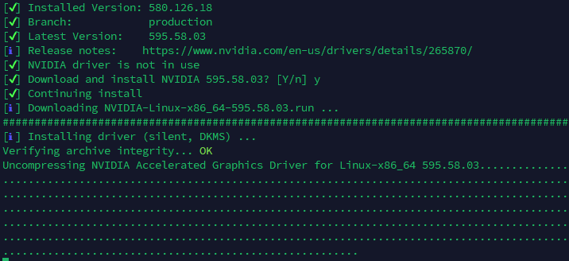
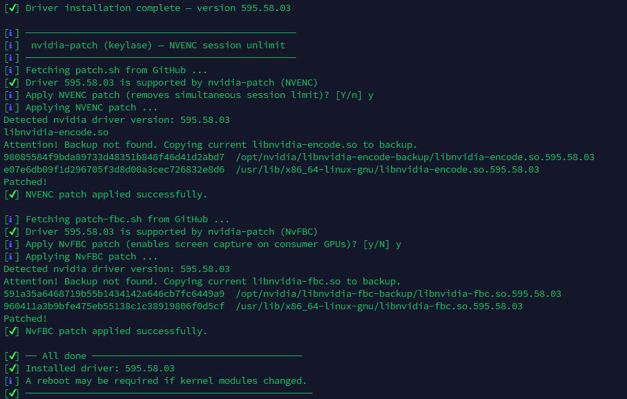

| NVIDIA Version | Ubuntu Version | Release Status |
|:--------------:|:-------------:|:--------------:|
| `<!--NV_VERSION-->` | `<!--UBUNTU_VERSION-->` | `<!--RELEASE_STATUS-->` |

--- 

# nvidia-upgrade

Install & Upgrade the latest NVIDIA DKMS driver for Ubuntu (headless servers)

---

## Overview

This script installs or upgrades the latest NVIDIA Geforce drivers on Ubuntu headless servers (e.g., Plex/Emby/AI workloads).

- **Branch selection:** Installs the latest Production, New Feature, or Beta branch (configurable via `DRIVER_BRANCH` in the script).
- **Automatic patching:** Optionally applies [nvidia-patch](https://github.com/keylase/nvidia-patch) for NVENC/NvFBC unlock.
- **Interactive/Automated:** By default, prompts before reinstalling the latest version. Set `interactive=false` for full automation.

---

## Usage

1. Download or clone this repository to your server.
2. Make the script executable:
	 ```bash
	 chmod +x nvidia-upgrade.sh
	 ```
3. Run as root:
	 ```bash
	 sudo ./nvidia-upgrade.sh
	 ```

### Options

- To run fully automated, set `interactive=false` in the script.
- To select a different driver branch, set `DRIVER_BRANCH` to `production`, `new-feature`, or `beta`.
- To automate via cron, add to root's crontab:
	```cron
	# Run NVIDIA Driver Upgrade (1st Monday of the month at 2am)
	0 2 1-7 * MON /path/to/scripts/nvidia-upgrade/nvidia-upgrade.sh
	```

---

## Screenshots

<div align="center">
	<table>
		<tr>
			<td></td>
			<td></td>
		</tr>
		<tr>
			<td align="center">Driver Install</td>
			<td align="center">Driver Patch</td>
		</tr>
	</table>
</div>

---

## How it works

1. Detects installed NVIDIA driver version (via DKMS or nvidia-smi)
2. Fetches the latest available driver for the selected branch
3. Checks if upgrade is needed; prompts if already latest (unless automated)
4. Downloads and installs the driver silently (with DKMS)
5. Optionally applies nvidia-patch for NVENC/NvFBC unlock
6. Cleans up and restarts any stopped Docker containers

---

## GitHub Actions Workflow

A workflow (see `.github/workflows/test-and-badge.yml`) simulates a test run, extracts the latest NVIDIA and Ubuntu versions, and updates the above table with the current status.

---

## License

MIT
